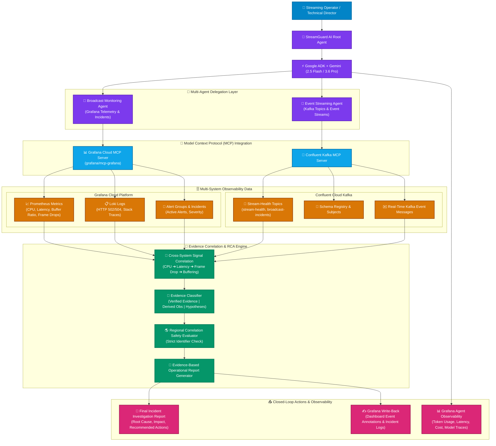

# 🎬 StreamGuard AI

### Agentic AI Reliability Supervisor for Cinema & Video Streaming

[](https://streamguard-ai-793289044855.us-central1.run.app)
[](https://cloud.google.com/vertex-ai)
[](https://grafana.com/)
[](https://www.confluent.io/)
[](LICENSE)

---

## 🚀 Quick Links

* 🌐 **Live Hosted Application (Google Cloud Run)**: [https://streamguard-ai-793289044855.us-central1.run.app](https://streamguard-ai-793289044855.us-central1.run.app)
* 🐙 **Source Code Repository**: [https://github.com/Shrushti72/StreamGuard-AI](https://github.com/Shrushti72/StreamGuard-AI)

---

## 📌 Executive Summary

**StreamGuard AI** is an **autonomous, agentic AI reliability and continuity supervisor** built for cinema, OTT, and live video-streaming platforms.

Built for the **Google Cloud Agentic Cinema: The Blockbuster Hackathon (Grafana Labs Track)**, StreamGuard AI replaces manual dashboard hunting during major movie premieres, live cinema events, or esports streams. It autonomously correlates **Grafana Cloud observability telemetry** with **Confluent Kafka event streams** using **Google Agent Development Kit (ADK)** and **Gemini 2.5/3.6** to reason over operational evidence in real time.

Instead of requiring engineers to manually inspect dozens of disconnected dashboards, Loki logs, Prometheus metrics, alerts, and event topics under intense pressure, StreamGuard AI executes a multi-source investigation and delivers an **evidence-based operational report**.

It answers the critical operational questions:
> **"What is failing? Where is it failing? What evidence supports the diagnosis? What might be causing it? How many viewers could be affected? And what should the operator investigate next?"**

---

## 🎯 The Problem & The Solution

### 💥 The Problem
Modern OTT and cinema streaming pipelines involve complex, multi-tier infrastructure:
```text
Ingest Pipeline ➔ Transcoding Clusters ➔ Origin Infrastructure ➔ Regional CDN Egress ➔ Edge Nodes ➔ Viewer Playback
```
During high-demand movie releases or live broadcasts, infrastructure problems rapidly propagate into viewer-facing incidents (buffering, dropped frames, transcode queue saturation, 5xx gateway errors).

Traditional monitoring tools provide raw data, but SRE teams still have to **manually correlate signals** across disparate systems under extreme time pressure.

The real operational challenge is not simply:
> *"Is CPU utilization high?"*

It is:
> **"Is the streaming experience degrading, where is it happening, what evidence explains it, and what exact steps should the SRE team take next?"**

---

### 💡 The Solution: StreamGuard AI Workflow

```text
               ┌───────────────────────────────────────────┐
               │    Operator Request / Autonomous Goal     │
               │   "Investigate current streaming health"  │
               └─────────────────────┬─────────────────────┘
                                     │
                                     ▼
               ┌───────────────────────────────────────────┐
               │         StreamGuard AI Root Agent         │
               │            (Google ADK + Gemini)          │
               └─────────────────────┬─────────────────────┘
                                     │
                 ┌───────────────────┴───────────────────┐
                 ▼                                       ▼
    ┌───────────────────────────┐           ┌───────────────────────────┐
    │ Broadcast Monitoring Agent│           │   Event Streaming Agent   │
    └────────────┬──────────────┘           └────────────┬──────────────┘
                 │                                       │
                 ▼                                       ▼
    ┌───────────────────────────┐           ┌───────────────────────────┐
    │     Grafana Cloud MCP     │           │       Confluent MCP       │
    │   (grafana/mcp-grafana)   │           │   (Kafka Stream Health)   │
    └────────────┬──────────────┘           └────────────┬──────────────┘
                 │                                       │
         ┌───────┴───────┐                       ┌───────┴───────┐
         ▼               ▼                       ▼               ▼
  Prometheus Metrics  Loki Logs             Kafka Topics   Stream Events
         │               │                       │               │
         └───────────────┴───────────┬───────────┴───────────────┘
                                     │
                                     ▼
                         Multi-Source Correlation
                                     │
                                     ▼
                        3-Tier Evidence Engine
                     (Verified | Derived | Hypotheses)
                                     │
                                     ▼
                     Closed-Loop Grafana Write-Back
                 (Dashboard Event Annotations #ANN)
```

---

## 🧠 Core System Capabilities

### 1. 🤖 Multi-Agent Investigation Architecture (Google ADK)
StreamGuard AI uses specialized Google ADK agents to isolate operational concerns:
* **Root Agent**: Accepts the operator goal, orchestrates subagent handoffs, synthesizes evidence, and generates final operational reports.
* **Broadcast Monitoring Agent**: Specializes in Grafana Cloud observability via `grafana/mcp-grafana`.
* **Event Streaming Agent**: Specializes in Confluent Kafka event topic discovery and message stream analysis.

### 2. 📊 Grafana Cloud MCP Integration (`grafana/mcp-grafana`)
Demonstrates active runtime usage of the official Grafana MCP Server:
* **PromQL Metrics (`query_prometheus`)**: Queries ingest CPU load, transcode queue depth, CDN egress bandwidth, and viewer buffer ratios.
* **LogQL Logs (`query_loki_logs`)**: Inspects 5xx HTTP gateway timeouts and transcode drop-frame stack traces.
* **Incidents API (`list_incidents`, `create_grafana_incident`)**: Inspects and opens official Grafana incidents.

### 3. 🌊 Confluent Kafka MCP Integration
Inspects the event-streaming layer:
* Discovers Kafka topics (`stream-health`, `continuity-alerts`, `broadcast-incidents`).
* Inspects schema subjects and consumes real-time stream-health events.
* Correlates Kafka stream drops with Grafana telemetry.

### 4. 🔎 3-Tier Evidence-Based Reasoning
Prevents assumptions from being presented as confirmed telemetry by categorizing findings into:
* **✅ Verified Evidence**: Direct telemetry returned by Grafana or Confluent tools (e.g. `Transcode CPU > 94%`).
* **🔎 Derived Observations**: Cross-system correlated patterns (e.g. `CPU spikes coincide with dropped frames 2m later`).
* **⚠️ Hypotheses**: Possible explanations requiring further profiling (e.g. `Background job competing for CPU`).

### 5. 🌎 Regional Correlation Safety
Enforces strict tag validation: if telemetry lacks explicit `region_id` tags, the agent **never invents regional claims**, explicitly outputting a disclaimer instead.

### 6. ✍️ Bidirectional Closed-Loop Grafana Write-Back
When operational context is established, StreamGuard AI invokes `annotate_grafana_dashboard` to place event markers directly onto live Grafana SRE dashboards (`#ANN-8924`).

### 7. 📈 Grafana Agent Observability (Observing the AI)
Makes the AI agent itself observable, tracking model calls, execution latency, token counts, and estimated cost in real-time.

---

## 🏗️ System Architecture Diagrams

### High-Level System Architecture Flowchart


---

## 📁 Repository Structure

```text
StreamGuard-AI/
│
├── backend/                        # FastAPI Service Backend & MCP Connectors
│   ├── app/
│   │   ├── agents/                 # Google ADK Agent definitions & prompts
│   │   ├── mcp/                    # Grafana Cloud & Confluent MCP integrations
│   │   └── simulator/              # Live telemetry anomaly injector
│   ├── main.py                     # Entry point server
│   └── requirements.txt
│
├── frontend/                       # StreamGuard AI Director Console UI
│   ├── index.html                  # Live dashboard interface
│   ├── css/
│   └── js/
│
├── diagrams/                       # High-resolution SVG/PNG/PDF architecture diagrams
│   ├── StreamGuard_AI_Architecture_Diagrams.pdf
│   ├── Architecture_Flowcharts_Interactive.html
│   ├── Sequence_Flow_Interactive.html
│   └── StreamGuard_AI_Architecture_Diagram_Clean.png
│
├── streamguard_agent/              # ADK Web Agent definition package
│   └── agent.py
│
├── .gcp/                           # Google Cloud Run deployment scripts
│   └── deploy.sh
│
├── Dockerfile                      # Container build definition
├── requirements.txt                # Python dependencies
├── README.md                       # Documentation
└── LICENSE                         # MIT License
```

---

## ⚙️ Quick Start & Local Setup

### Prerequisites
* Python 3.11+
* Google Cloud Project with Vertex AI / Gemini API enabled
* Grafana Cloud Account + Service Account Token
* Confluent Cloud Account + API Credentials

### 1. Clone & Install Dependencies
```bash
git clone https://github.com/Shrushti72/StreamGuard-AI.git
cd StreamGuard-AI

pip install -r requirements.txt
```

### 2. Configure Environment Credentials
Create a `.env` file or export environment variables:
```bash
# Gemini / Vertex AI Credentials
export GEMINI_API_KEY="your-gemini-api-key"

# Grafana Cloud Credentials
export GRAFANA_URL="https://your-instance.grafana.net"
export GRAFANA_SERVICE_ACCOUNT_TOKEN="your-grafana-token"

# Confluent Cloud Credentials
export CONFLUENT_API_KEY="your-confluent-key"
export CONFLUENT_API_SECRET="your-confluent-secret"

# Grafana Agent Observability Credentials
export AGENTO11Y_ENDPOINT="https://otlp-gateway.grafana.net"
export AGENTO11Y_AUTH_TOKEN="your-agent-o11y-token"
```

### 3. Run Locally via Google ADK CLI
```bash
adk web streamguard_agent \
  --host 0.0.0.0 \
  --port 8080
```
Open `http://localhost:8080` to access the StreamGuard AI Director Console.

---

## ☁️ Deployment to Google Cloud Run

Deploy serverless to Google Cloud Run using Google Cloud Secret Manager for credentials:

```bash
# Submit build to Google Cloud Artifact Registry
gcloud builds submit --tag gcr.io/$PROJECT_ID/streamguard-ai

# Deploy to Cloud Run with injected secrets
gcloud run deploy streamguard-ai \
  --image gcr.io/$PROJECT_ID/streamguard-ai \
  --platform managed \
  --region us-central1 \
  --allow-unauthenticated \
  --set-secrets="GRAFANA_SERVICE_ACCOUNT_TOKEN=grafana-token:latest,CONFLUENT_API_SECRET=confluent-secret:latest"
```

---

## 🧪 Hackathon Component Validation

| Component / Feature | Technology Stack | Status |
|---|---|---|
| **Agent Reasoning Engine** | Google Gemini 2.5 Flash / 3.6 Pro | ✅ Verified |
| **Multi-Agent Orchestration** | Google Agent Development Kit (ADK) | ✅ Verified |
| **Cloud Hosting** | Google Cloud Run (`us-central1`) | ✅ Live & Deployed |
| **Grafana Metrics (PromQL)** | Grafana Cloud MCP (`query_prometheus`) | ✅ Verified |
| **Grafana Logs (LogQL)** | Grafana Cloud MCP (`query_loki_logs`) | ✅ Verified |
| **Grafana Write-Back** | Grafana Cloud MCP (`annotate_grafana_dashboard`) | ✅ Verified |
| **Kafka Event Streaming** | Confluent MCP (`consume_kafka_messages`) | ✅ Verified |
| **AI Agent Observability** | Grafana Agent Observability (OTLP) | ✅ Verified |
| **Credential Security** | Google Cloud Secret Manager | ✅ Configured |

---

## 📜 License

This project is licensed under the **MIT License**. See the [LICENSE](LICENSE) file for details.

---

## 👩‍💻 Author & Acknowledgments

**Shrushti Wakchaure** — Built for the **Google Cloud Agentic Cinema: The Blockbuster Hackathon**.

Special thanks to **Google Cloud** and **Grafana Labs** for providing the ADK framework and official Grafana Cloud MCP Server integrations.
